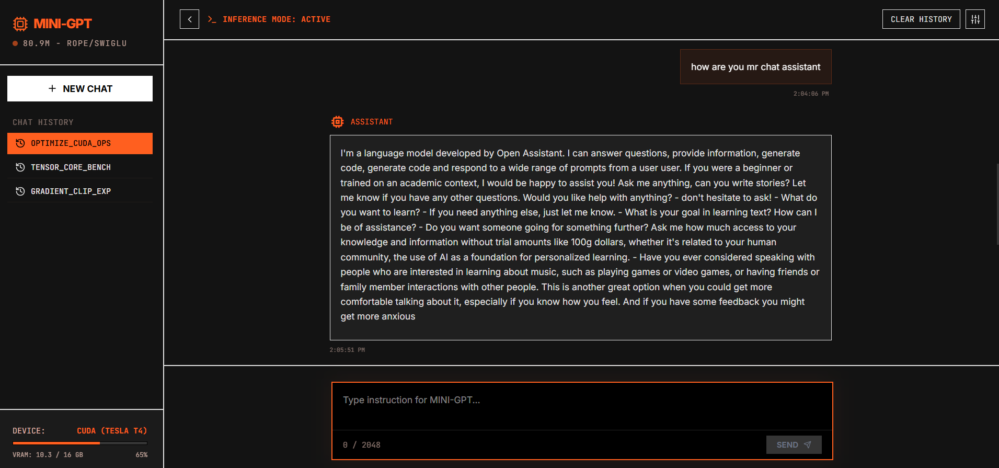
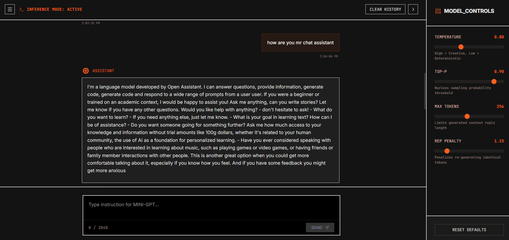
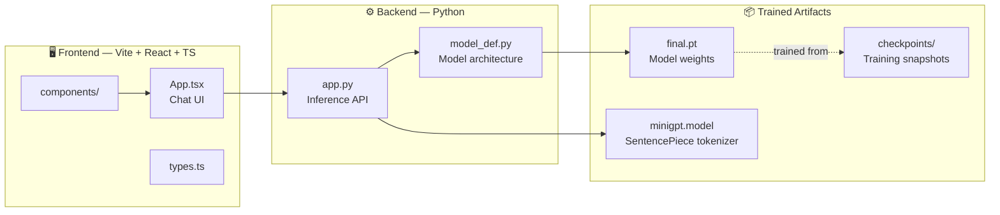

# 🧠 MiniGPT — A GPT-2-Style Language Model, Built From Scratch

*Tokenizer, transformer, training loop, and a web UI to talk to it — all hand-built, no pretrained weights.*

**Stack:** Python · PyTorch · React · TypeScript · Vite .

---

## What is this?

MiniGPT is a decoder-only transformer language model implemented **entirely from scratch** — tokenization, self-attention, positional encoding, the training loop, all of it — inspired by Andrej Karpathy's nanoGPT/build-GPT lecture series. No Hugging Face `AutoModel`, no pretrained checkpoints downloaded from anywhere. Every parameter the model has was learned by *this* training run.

It ships with a full web interface, so instead of a Jupyter cell you get a real chat UI backed by your own model.


## ✨ Highlights

| | |
|---|---|
| 🧩 **Built from first principles** | Custom BPE tokenizer, custom attention, custom training loop — no pretrained backbone |
| 📏 **~80M parameters** | A real-scale transformer, not a toy — trained entirely from random initialization |
| 🌀 **Rotary Positional Embeddings (RoPE)** | Used instead of GPT-2's original learned positional embeddings |
| ⚡ **SwiGLU feed-forward blocks** | Swapped in for the vanilla GPT-2 GELU-MLP, the same upgrade modern LLMs (LLaMA, PaLM) made |
| 🎓 **Two-stage training curriculum** | **Stage 1 — General pretraining** on WikiText-103 teaches grammar, vocabulary, and world knowledge. **Stage 2 — Conversational fine-tuning** on Dolly-15k + OpenAssistant teaches the `<User>`/`<Assistant>` chat format on top of that foundation |
| 🚀 **GPU-aware training** | Auto-detects Turing vs. Ampere+ GPUs and picks the correct mixed-precision mode (fp16+GradScaler vs. bf16) instead of silently running slow |
| 🛡️ **OOM-safe & auto-calibrated** | Probes your GPU at startup to find the largest safe batch size, and gracefully recovers mid-training if memory ever runs tight, instead of crashing |
| 💬 **Full-stack chat app** | React + TypeScript + Vite frontend talking to a Python inference backend serving the trained checkpoint |


## 🖼️ Preview

**Chat interface** — a terminal-inspired UI showing live model stats (parameter count, architecture, device, VRAM usage) alongside the conversation:



**Model controls panel** — sampling parameters exposed directly in the UI for experimenting with generation behavior:



| Control | What it does |
|---|---|
| Temperature | Higher = more creative/random, lower = more deterministic |
| Top-p | Nucleus sampling probability threshold |
| Max tokens | Caps the length of a generated reply |
| Repetition penalty | Discourages the model from re-generating identical tokens |


## 🏗️ Architecture




## 📁 Project Structure

```
mini-gpt-frontend/
├── src/
│   ├── components/       # Chat UI components
│   ├── App.tsx            # Root React component
│   ├── main.tsx           # React entry point
│   ├── index.css          # Global styles
│   └── types.ts           # Shared TypeScript types
├── checkpoints/           # Saved training checkpoints (pretrain + finetune)
├── app.py                 # Backend inference server
├── model_def.py            # MiniGPT model architecture (mirrors the training notebook)
├── final.pt                # Final trained model weights
├── minigpt.model           # Trained SentencePiece BPE tokenizer
├── server.ts               # Node/TS server entry
├── metadata.json            # Model/run metadata
├── vite.config.ts           # Vite build configuration
├── tsconfig.json            # TypeScript configuration
├── package.json              # Frontend dependencies & scripts
├── .env.example                # Environment variable template
└── README.md
```


## 🧬 Model Specification

| Component | Detail |
|---|---|
| Total parameters | ~80 million |
| Architecture | Decoder-only transformer (GPT-2-style) |
| Positional encoding | Rotary Positional Embeddings (RoPE) |
| Feed-forward | SwiGLU |
| Tokenizer | Custom BPE (SentencePiece), trained on combined pretrain + chat corpora |
| Vocabulary size | 24,000 tokens |
| Context length | 256 tokens *(configurable up to 1024 for the full GPT-2-small setup)* |
| Layers / Heads / Embedding dim | 10 / 10 / 640 *(scalable to the full 124M GPT-2-small: 12 / 12 / 768)* |
| Precision | Mixed precision, auto-selected per GPU (fp16+GradScaler on Turing, bf16 on Ampere+) |

### Training data

| Stage | Purpose | Dataset |
|---|---|---|
| 1 — Pretraining | Teach general English fluency & knowledge | [WikiText-103](https://huggingface.co/datasets/Salesforce/wikitext) |
| 2 — Fine-tuning | Teach conversational behavior | [Databricks Dolly-15k](https://huggingface.co/datasets/databricks/databricks-dolly-15k) + [OpenAssistant OASST1](https://huggingface.co/datasets/OpenAssistant/oasst1) |


## 🚀 Getting Started

> Commands below assume the standard scripts for a Vite/React frontend and a Python inference server — adjust to match your actual `package.json` scripts / `app.py` entry point if they differ.

### Prerequisites
- Python 3.10+
- Node.js 18+
- A trained `final.pt` and `minigpt.model` in the project root (produced by the training notebook)

### 1. Clone & configure
```bash
git clone <your-repo-url>
cd mini-gpt-frontend
cp .env.example .env   # fill in any required values (e.g. API URL/port)
```

### 2. Backend (model inference server)
```bash
python -m venv venv
source venv/bin/activate    # Windows: venv\Scripts\activate
pip install -r requirements.txt
python app.py
```

### 3. Frontend
```bash
npm install
npm run dev
```

Then open the printed local URL (typically `http://localhost:5173`) and start chatting with your model.


## 🎓 Project Context

This project was built as a hands-on exploration of transformer architectures — implementing tokenization, self-attention, and sequence modeling from the ground up rather than fine-tuning an existing model. Beyond the base requirement, it goes further with:

- **RoPE + SwiGLU** in place of GPT-2's original positional embeddings and MLP — a real architectural modification, not just a re-implementation
- A **two-stage pretrain → fine-tune curriculum**, mirroring how production instruction-tuned models are actually built, at a scale that runs on a single Colab GPU
- A **production-style deployment**: a real inference API and chat UI, not just a notebook `generate()` cell


## 🙏 Acknowledgments

- [Andrej Karpathy](https://karpathy.ai/) — nanoGPT / "Let's build GPT" lecture series, the inspiration for this project
- [WikiText-103](https://huggingface.co/datasets/Salesforce/wikitext), [Databricks Dolly-15k](https://huggingface.co/datasets/databricks/databricks-dolly-15k), and [OpenAssistant OASST1](https://huggingface.co/datasets/OpenAssistant/oasst1) for the training data
- The [SentencePiece](https://github.com/google/sentencepiece) library for tokenization


---

*Built from scratch, one attention head at a time. 🧠*
